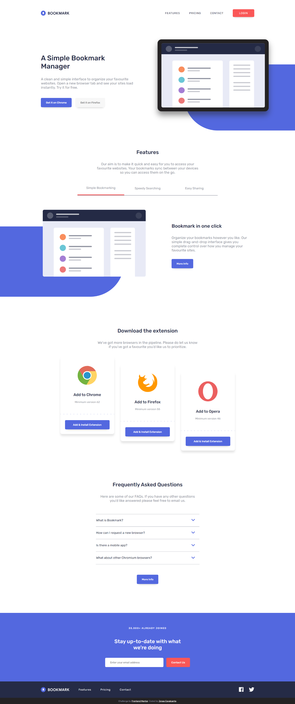

# Frontend Mentor - Bookmark landing page solution

This is a solution to the [Bookmark landing page challenge on Frontend Mentor](https://www.frontendmentor.io/challenges/bookmark-landing-page-5d0b588a9edda32581d29158). Frontend Mentor challenges help you improve your coding skills by building realistic projects. 

## Overview

### The challenge

Users should be able to:

- View the optimal layout for the site depending on their device's screen size
- See hover states for all interactive elements on the page
- Receive an error message when the newsletter form is submitted if:
  - The input field is empty
  - The email address is not formatted correctly

### Screenshot

### Links

- Live Site URL: [Link](https://jonascavalcante.github.io/bookmark-landing-page)

## My process

### Built with

- HTML5
- SASS
- JavaScript

## Author

- Frontend Mentor - [@jonascavalcante](https://www.frontendmentor.io/profile/jonascavalcante)
- LinkedIn - [@jonascavalcante](https://www.linkedin.com/in/jonascavalcante)